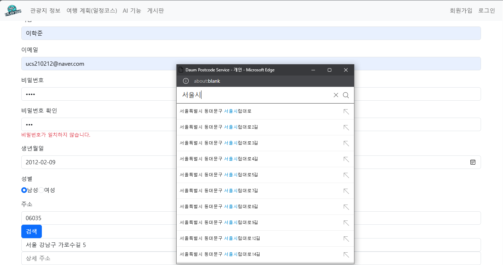
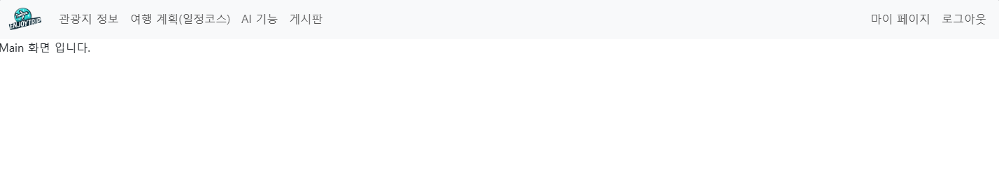

# EnjoyTrip 요구사항 목록
## F01 지역별 관광지 정보 수집

- 예시 : 서울 관광지 정보 가져오기

  

  - 임시 데이터를 불러온 후, 카카오 맵 지도에 마커로 표시하는 기능을 구현했습니다.
  - 현재는 4개의 데이터만 불러오도록 해놓았으나, 추후에 페이징 처리와 함께 해당 부분을 개선할 예정입니다.
  
  

## F02,F03 관광지, 숙박, 음식점 조회

 

- 임시 데이터를 불러온 후, 이미지, 위치와 함께 상세보기로 갈 수 있는 리스트를 구현했습니다.

 

## F07 회원 관리

- 예시 : 회원가입 기능

- 최종 프로젝트에 필요한 모든 회원 정보를 입력할 수 있도록 구현하였습니다

 
## F08 회원관리(회원가입, 수정, 조회, 탈퇴)
- 예시 : 로그인 및 로그인 후의 상태

- 로그인, 로그아웃 기능입니다. 로그인 후 상단의 회원가입과 로그인 버튼이 사라지고 마이페이지와 로그아웃 버튼이 생긴것을 볼 수 있습니다.

## F10 공유 게시판
- 예시 : 게시판의 글 목록과 상세 내용

- 해당 게시판에서 글을 조회, 수정, 삭제, 추가를 할 수 있습니다.
  
